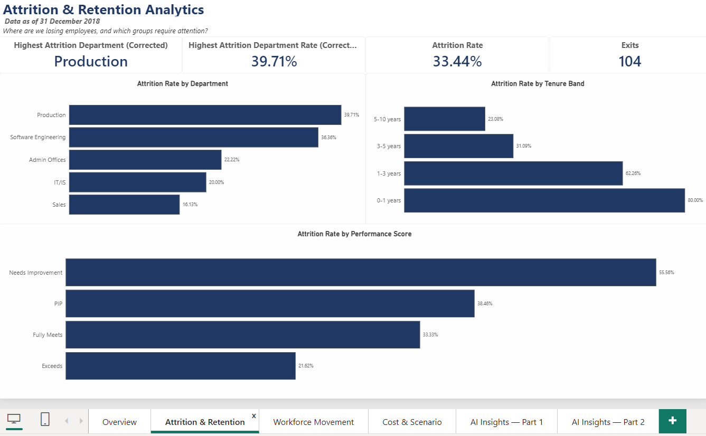
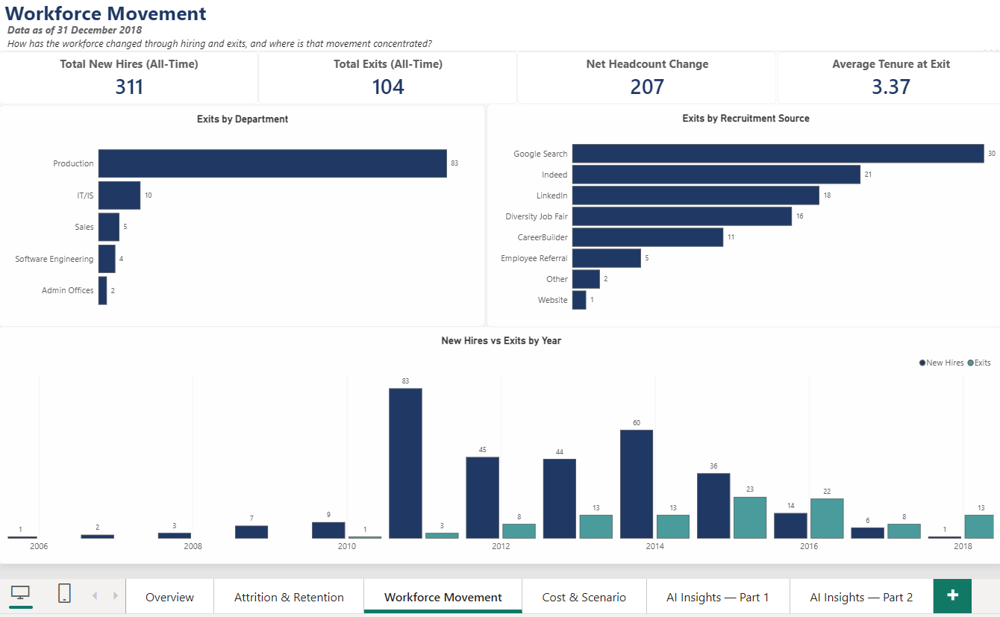
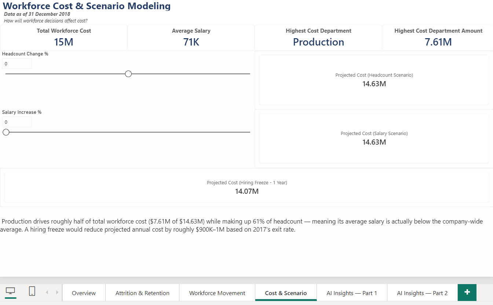
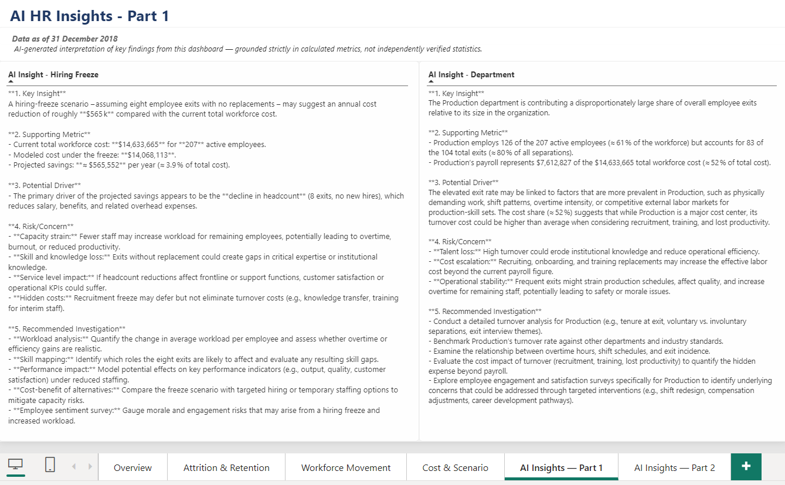
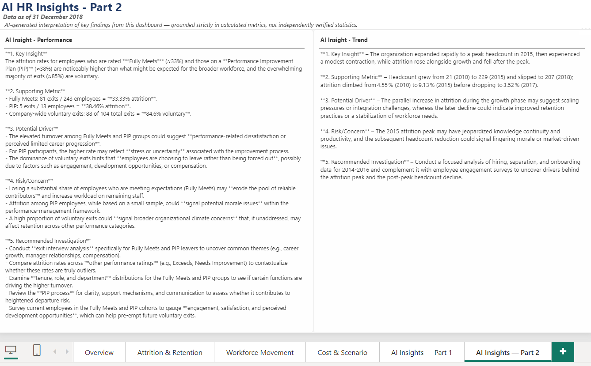

# 🏭 People Analytics Command Center

A Power BI workforce analytics solution designed to help HR leaders move from **workforce reporting to evidence-based people decisions**.

The solution answers four key questions:

- **How is our workforce changing?**
- **Where are we losing people?**
- **What workforce risks should HR investigate?**
- **Where should HR take action first?**

> **Raw HR Data → HR Reporting → People Analytics → Business Insights → HR Decision Support**

---

## 📌 Executive Overview

The **People Analytics Command Center** transforms HR data into an executive-level view of workforce composition, attrition, employee movement and workforce cost.

Built using the **HRDataset_v14** public dataset containing 311 employee records and data through **31 December 2018**, the solution combines Power BI analytics with an AI-assisted insights layer to translate workforce metrics into structured HR narratives.

The objective is not simply to show what happened.

It is to identify:

> **What changed → where the risk is concentrated → why HR should investigate it → what action could be considered next.**

---

## 🖥️ Dashboard Structure

The solution is organized into six analytical pages:

1. **Executive Workforce Overview** — workforce size, growth and attrition trends
2. **Attrition & Retention** — attrition by tenure, performance and department
3. **Workforce Movement** — hires, exits and workforce movement patterns
4. **Workforce Cost & Scenario** — workforce cost and scenario modelling
5. **AI Insights 1** — AI-assisted interpretation of workforce findings
6. **AI Insights 2** — AI-assisted HR investigation and recommendations

---

# 🎯 Executive Summary

## The Headline Story

Within the HRDataset_v14 sample, headcount increased from **21 employees in 2010 to a peak of 229 in 2015**, before declining to **207 employees by the end of 2018**.

Attrition also increased during the growth period before declining as workforce growth stabilized.

By 2018, the gap between new hires and exits had narrowed considerably, suggesting a potential shift from strong workforce expansion toward a more stable or potentially contracting workforce position.

Attrition is also **not evenly distributed across the organization**.

The strongest signals are concentrated around:

- **Production**
- **Software Engineering**
- **Early-tenure employees**
- Employees with lower performance ratings

### Key People Analytics Message

This does not appear to be a simple company-wide retention problem.

The data points toward **specific workforce segments requiring targeted investigation**, particularly Production and employees during their first year of employment.

> **The dashboard identifies where the risk is concentrated. HR investigation is required to understand why.**

---

# 🚨 Priority People Risks

| Priority | People Risk | What the data indicates | HR Implication |
|---|---|---|---|
| 🔴 1 | **Production attrition** | High exit volume and elevated attrition | Investigate department-specific retention drivers |
| 🔴 2 | **Early-tenure attrition** | Attrition is heavily concentrated among employees with less than 1 year of tenure | Review onboarding, role clarity and early manager experience |
| 🟠 3 | **Software Engineering attrition** | Elevated attrition | Investigate role, manager and employee-experience factors |
| 🟠 4 | **Hires vs exits convergence** | Hires and exits became increasingly close by 2018 | Monitor workforce growth and replacement demand |
| 🟡 5 | **Production workforce cost** | Production represents a significant share of workforce cost | Balance cost optimization with operational workforce risk |

---

# 📊 1. Executive Workforce Overview


## What the data shows

Headcount increased from **21 employees in 2010 to 229 in 2015**, before declining to **207 employees by the end of 2018**.

Attrition also changed throughout the period:

- 2010: **4.55%**
- 2015: **9.13%**
- 2017: **3.52%**
- 2018: **5.91%**

## Insight

The period of rapid workforce expansion coincided with higher attrition.

This suggests that future growth phases may create additional retention pressure if hiring volume increases faster than the organization's ability to support onboarding, management capacity and employee integration.

The data does **not establish causation**, so this should be treated as a **workforce risk signal requiring further investigation**, rather than a confirmed root cause.

## Recommended HR Action

### Workforce Growth & Retention Review

If the organization enters another rapid growth phase, HR should:

- Assess onboarding capacity before scaling hiring
- Monitor manager span of control
- Track early-tenure attrition
- Compare hiring volume against exit trends
- Establish workforce health indicators alongside hiring targets

### Success Measures

- First-year retention
- Overall attrition
- New-hire retention
- Manager span of control
- Headcount growth vs exit rate

---

# 📉 2. Attrition & Retention



## What the data shows

Attrition varies significantly by performance category:

- **Needs Improvement:** 55.56%
- **Performance Improvement Plan:** 38.46%
- **Exceeds:** 21.62%

By tenure, attrition is heavily concentrated among employees with **less than one year of tenure**, with the rate generally declining as tenure increases.

Two departments also stand out:

- **Production:** 39.71%
- **Software Engineering:** 36.36%

## Insight

The strongest signal is the concentration of exits among **early-tenure employees**.

This makes the first year of the employee lifecycle an important area for HR investigation.

The dashboard identifies **where attrition is concentrated**, but the available data does not establish the underlying causes.

Potential areas for investigation include:

- Onboarding effectiveness
- Role clarity
- Hiring/job fit
- Manager relationship
- Early performance expectations
- Employee experience
- Career expectations

## Recommended HR Action

### First-Year Retention Review

HR could conduct a structured review of the first **90–365 days** of employment.

**0–30 days**

- Onboarding completion
- Role clarity
- Manager introduction
- Access to tools and resources

**31–60 days**

- Manager check-in
- Early performance feedback
- Employee experience pulse

**61–90 days**

- Role expectations
- Development needs
- Engagement indicators

**3–12 months**

- Retention risk
- Performance progression
- Career expectations
- Voluntary exit patterns

### Success Measures

- 90-day retention
- 12-month retention
- Early-tenure attrition
- Onboarding completion
- New-hire engagement

---

# 🏭 3. Workforce Movement



## What the data shows

Production accounts for **83 of 104 total exits**, representing approximately **80% of exits** while accounting for approximately **61% of headcount**.

The department therefore stands out through both:

- Exit volume
- Attrition rate

The gap between hires and exits also narrowed significantly after 2016, with the two measures approaching one another by 2018.

## Insight

Production is the **highest-priority investigation area** because the signal appears consistently across multiple workforce lenses.

The narrowing gap between hires and exits is also an important workforce planning indicator.

If exits continue to approach hiring volume, the organization could move from workforce growth toward **net workforce contraction**.

## Recommended HR Action

### Production Retention Diagnostic

Rather than immediately implementing a broad retention program, HR should first investigate:

- Exit reason
- Tenure at exit
- Job role
- Manager
- Performance
- Work pattern
- Hiring source
- Employee experience
- Compensation, where available

The objective is to determine whether the high attrition reflects a **shared department-level issue or several different issues within Production**.

### Success Measures

- Production attrition
- Production voluntary attrition
- First-year Production retention
- Exit volume
- Time-to-fill replacement roles

---

# 💰 4. Workforce Cost & Scenario



## What the data shows

Total workforce cost is approximately **$14.63M across 207 active employees**, with an average salary of approximately **$71K**.

Production represents approximately:

- **61% of headcount**
- **52% of total workforce cost**

A modeled hiring freeze using the **2017 exit rate** and no replacement hiring produces approximately **$565K in annualized savings**.

## Insight

The scenario demonstrates that workforce decisions cannot be evaluated purely through salary savings.

Production represents a large share of the organization's workforce, so reducing headcount through natural attrition may create operational risk even when it produces short-term cost savings.

## Recommended HR Action

### Workforce Cost & Capacity Review

Instead of asking only:

> **"How much can we save?"**

HR should also ask:

> **"Where can we optimize workforce cost while protecting critical workforce capability?"**

Potential scenarios include:

- Targeted hiring controls
- Selective replacement hiring
- Workforce redeployment
- Role prioritization
- Natural attrition
- Productivity improvements

### Success Measures

- Workforce cost
- Cost per employee
- Headcount vs budget
- Replacement hiring demand
- Critical role coverage
- Productivity indicators

---

# 🤖 5–6. AI-Assisted HR Insights





## What the AI Layer Does

The solution includes an AI-assisted insights layer built using **Power Query and the Groq API**.

The AI receives **pre-calculated workforce metrics** and generates structured HR narratives using:

**Key Insight → Supporting Metric → Potential Driver → Risk / Concern → Recommended Investigation**

## Responsible AI Approach

The AI layer is deliberately constrained:

- It does not receive raw employee-level data
- It interprets pre-calculated workforce metrics
- It does not create statistics
- It uses cautious, non-causal language
- It supports the analyst rather than replacing human judgment

## Insight

AI is treated as an **analytics accelerator**, not as the decision-maker.

The People Analytics process remains:

```text
Business Question
       ↓
Data
       ↓
Metric
       ↓
Insight
       ↓
HR Investigation
       ↓
Action
       ↓
Outcome

---

# About Me

**Joyce Lee How Yee**

PL-300 Certified Business Intelligence & Data Analyst with experience in **People Analytics, HR reporting, Power BI, SQL, Python, and data visualization**. Passionate about transforming complex data into actionable business insights.

Currently open to:

- Business Intelligence Analyst roles
- Data Analyst roles
- People Analytics roles
- Reporting Analyst roles

📎 LinkedIn: https://www.linkedin.com/in/joyceleehowyee/

📎 GitHub Portfolio: https://github.com/joyceleehy
