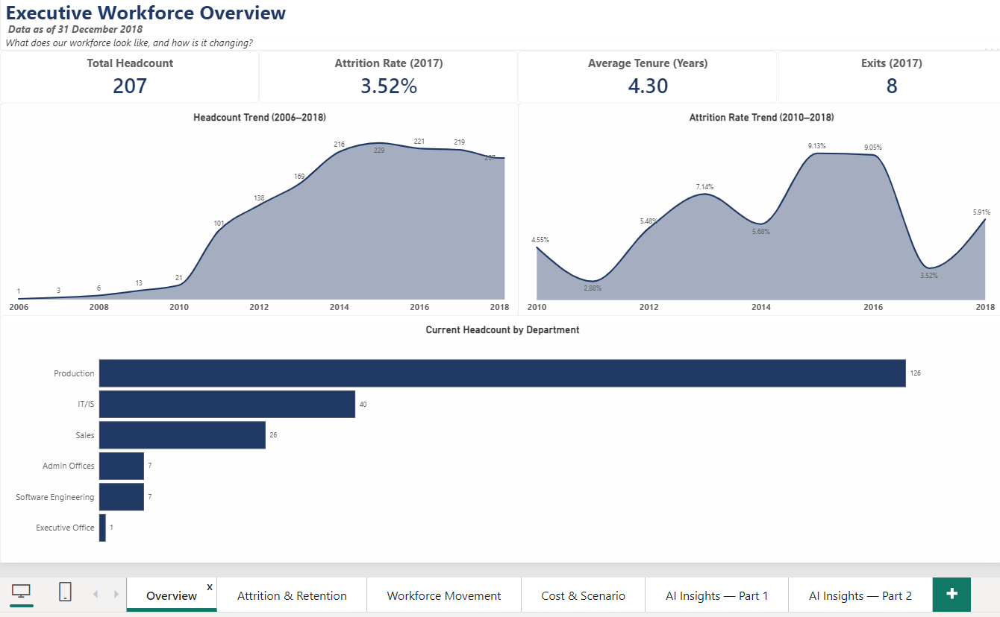

# People Analytics Command Center

A Power BI workforce analytics solution designed to help HR leaders move from **workforce reporting to evidence-based people decisions**.

The solution answers four questions:

- **How is our workforce changing?**
- **Where are we losing people?**
- **What workforce risks should HR investigate?**
- **Where should HR take action first?**

**Raw HR Data → HR Reporting → People Analytics → Business Insights → HR Decision Support**

---

## 📌 Executive Overview

The **People Analytics Command Center** transforms HR data into an executive-level view of workforce composition, attrition, employee movement and workforce cost.

Built using the **HRDataset_v14** dataset containing 311 employees and data through 31 December 2018, the solution combines Power BI analytics with an AI-assisted insights layer to translate calculated workforce metrics into structured HR narratives.

The objective is not simply to show what happened.

It is to identify:

> **What changed → where the risk is concentrated → why HR should investigate it → what action could be considered next.**

---

## 🖥️ Dashboard Structure

The solution is organized into six analytical pages:

1. **Executive Workforce Overview** — workforce size, growth and attrition trends
2. **Attrition & Retention** — attrition by tenure, performance and department
3. **Workforce Movement** — hires, exits and workforce movement patterns
4. **Workforce Cost & Scenario** — workforce cost and scenario modelling
5. **AI Insights 1** — AI-assisted interpretation of workforce findings
6. **AI Insights 2** — AI-assisted HR investigation and recommendations

> **Note:** The screenshot above shows the dashboard page structure. The individual page screenshots provide the detailed visual analysis.

---

# 🎯 Executive Summary

### The headline story

The organization experienced significant workforce growth between 2010 and 2015, with headcount increasing from 21 employees to a peak of 229.

Attrition also increased during the growth period before declining as workforce growth stabilized.

By 2018, however, the gap between new hires and exits had narrowed considerably, suggesting a potential shift away from strong workforce expansion toward a more stable or potentially contracting workforce position.

The attrition analysis also shows that turnover is **not evenly distributed across the organization**.

The strongest signals are concentrated around:

- **Production**
- **Software Engineering**
- **Early-tenure employees**
- Employees with lower performance ratings

### The key People Analytics message

This does not appear to be a simple company-wide retention problem.

The data points toward **specific workforce segments requiring targeted investigation**, particularly Production and employees during their first year of employment.

That creates an opportunity for HR to move away from broad retention initiatives and toward **targeted, evidence-based interventions**.

---

# 🚨 Priority People Risks

| Priority | People Risk | What the data indicates | HR implication |
|---|---|---|---|
| 🔴 1 | Production attrition | Production has both high exit volume and elevated attrition | Investigate department-specific retention drivers |
| 🔴 2 | Early-tenure attrition | Attrition is heavily concentrated among employees with less than one year of tenure | Review onboarding, role clarity and early manager experience |
| 🟠 3 | Software Engineering attrition | Software Engineering also shows elevated attrition | Conduct role, manager and employee-experience analysis |
| 🟠 4 | Hires vs exits convergence | New hires and exits were increasingly close by 2018 | Monitor workforce growth and replacement demand |
| 🟡 5 | Workforce cost concentration | Production represents a significant share of workforce cost | Balance cost reduction with operational workforce risk |

This prioritization helps HR focus resources on the areas where the data shows the strongest signals.

---

# 📊 1. Executive Workforce Overview



## What the data shows

Headcount increased from **21 employees in 2010 to 229 in 2015**, before declining to **207 employees by the end of 2018**.

Attrition also increased during the growth period:

- 2010: **4.55%**
- 2015: **9.13%**
- 2017: **3.52%**
- 2018: **5.91%**

## Insight

The period of rapid workforce expansion coincided with higher attrition.

This suggests that future growth phases may create additional retention pressure if hiring volume increases faster than the organization's ability to support onboarding, management capacity and employee integration.

The data does not establish causation, so these should be treated as **workforce risk signals requiring further investigation** rather than confirmed root causes.

## Recommended HR action

If the organization enters another rapid growth phase:

1. Assess onboarding capacity before scaling hiring.
2. Monitor manager span of control.
3. Track early-tenure attrition monthly.
4. Compare attrition trends against hiring volume.
5. Establish workforce health indicators alongside hiring targets.

### Success measures

- First-year retention
- Overall attrition
- New-hire retention
- Manager span of control
- Headcount growth vs exit rate

---

# 📉 2. Attrition & Retention Analytics

## What the data shows

Attrition is highest among employees rated **Needs Improvement (55.56%)** and employees on a **Performance Improvement Plan (38.46%)**.

Attrition is lowest among employees rated **Exceeds (21.62%)**.

By tenure, attrition is heavily concentrated among employees with less than one year of tenure, with the rate declining as tenure increases.

Two departments also stand out:

- **Production: 39.71%**
- **Software Engineering: 36.36%**

## Insight

The strongest signal is the concentration of exits among early-tenure employees.

This makes the first year of the employee lifecycle an important area for HR investigation.

Potential areas to investigate include:

- onboarding effectiveness
- role clarity
- hiring/job fit
- manager relationship
- early performance expectations
- employee experience during the first 90 days

The available data identifies **where the risk is concentrated**, but additional employee-level feedback would be required to determine the underlying causes.

## Recommended HR action

### First-Year Retention Review

HR could conduct a structured review of the first 90–365 days of employment:

**0–30 days**
- onboarding completion
- role clarity
- manager introduction
- access to tools and resources

**31–60 days**
- manager check-in
- early performance feedback
- employee experience pulse

**61–90 days**
- role expectations
- development needs
- engagement indicators

**3–12 months**
- retention risk
- performance progression
- career expectations
- voluntary exit patterns

### Success measures

- 90-day retention
- 12-month retention
- early-tenure attrition
- onboarding completion
- new-hire engagement

---

# 🏭 3. Workforce Movement

## What the data shows

Production accounts for **83 of 104 total exits**, representing approximately 80% of exits while accounting for approximately 61% of headcount.

The department therefore stands out through both:

- exit volume
- attrition rate

The gap between hires and exits also narrowed significantly after 2016, with the two measures approaching one another by 2018.

## Insight

Production is the highest-priority investigation area because the signal appears consistently across multiple workforce lenses.

The narrowing gap between hires and exits is also an important leading indicator.

If exits continue to approach hiring volume, the organization could move from workforce growth toward **net workforce contraction**.

## Recommended HR action

### Production Retention Diagnostic

Rather than immediately implementing a broad retention program, HR should first investigate:

- exit reason
- tenure at exit
- job role
- manager
- performance
- work pattern
- hiring source
- employee experience
- compensation, where available

The objective is to determine whether the high attrition reflects a **shared department-level issue or several different issues within Production**.

### Success measures

- Production attrition
- Production voluntary attrition
- First-year Production retention
- Exit volume
- Time-to-fill replacement roles

---

# 💰 4. Workforce Cost & Scenario Modelling

## What the data shows

Total workforce cost is approximately **$14.63M across 207 active employees**, with an average salary of approximately **$71K**.

Production represents approximately:

- **61% of headcount**
- **52% of total workforce cost**

A modeled hiring freeze using the 2017 exit rate and no replacement hiring produces approximately **$565K in annualized savings**.

## Insight

The cost scenario demonstrates that workforce decisions cannot be evaluated purely through salary savings.

Production represents a large share of the organization's workforce, so reducing headcount through natural attrition may create operational risk even when it produces short-term cost savings.

## Recommended HR action

Instead of asking only:

> **"How much can we save?"**

HR should ask:

> **"Where can we reduce workforce cost while protecting critical workforce capacity?"**

Potential scenarios include:

- targeted hiring controls
- selective replacement hiring
- workforce redeployment
- role prioritization
- natural attrition
- productivity improvements

### Decision principle

**Cost optimization should be evaluated together with workforce capability and operational risk.**

---

# 🤖 5–6. AI-Assisted HR Insights

The solution includes a live AI-assisted insights layer built using **Power Query and the Groq API** across two dedicated AI insight pages.

The AI layer receives calculated workforce metrics and generates structured interpretations using:

**Key Insight → Supporting Metric → Potential Driver → Risk / Concern → Recommended Investigation**

The AI is deliberately constrained:

- It does not receive raw employee data.
- It interprets pre-calculated metrics.
- It does not create statistics.
- It uses cautious, non-causal language.
- It supports the analyst rather than replacing human judgment.

## Why this matters

AI is treated as an **analytics accelerator**, not as the decision-maker.

The People Analytics process remains:

**Business Question → Data → Metric → Insight → HR Investigation → Action → Outcome**

The AI layer helps scale the communication of insights, while HR judgment remains essential for understanding context and deciding interventions.

---

# 🔎 Questions I Would Ask HR

The dashboard identifies workforce signals.

The next step is to investigate the reasons behind those signals.

### Production

- Are exits concentrated under specific managers?
- Are particular roles or work patterns affected?
- Are exits mainly voluntary or involuntary?
- Are employees leaving during their first year?
- What are the most common exit reasons?
- Are high-performing employees leaving?

### Software Engineering

- Are exits concentrated in particular roles?
- Is tenure similar to the Production pattern?
- Are workload or career-development concerns present?
- Are particular managers or teams affected?

### Early-Tenure Employees

- Where does the employee experience break down?
- Are expectations clear at hiring?
- Is onboarding consistent?
- Are managers conducting regular check-ins?
- Are employees leaving before reaching full productivity?

These questions convert dashboard findings into a **real People Analytics investigation plan**.

---

# 🧭 From Insight to Action

The analytical approach used in this project is:

```text
BUSINESS QUESTION
       ↓
DATA QUALITY
       ↓
HR METRICS
       ↓
SEGMENTATION
       ↓
INSIGHT
       ↓
ROOT-CAUSE HYPOTHESIS
       ↓
HR INVESTIGATION
       ↓
INTERVENTION
       ↓
BUSINESS OUTCOME
       ↓
MONITOR & REFINE
```

The purpose of People Analytics is therefore not simply to report workforce metrics.

It is to create a repeatable process for turning workforce evidence into better decisions.

---

# 🚀 Recommended Next Steps

If this were connected to a live HRIS environment, I would prioritize the following:

### Immediate — Production

Launch a focused retention diagnostic for Production and Software Engineering using exit reasons, tenure, role, manager and employee-experience data.

### Short Term — First-Year Retention

Audit the first 90 days of the employee lifecycle and establish a new-hire retention monitoring framework.

### Medium Term — Workforce Planning

Monitor the relationship between hires, exits and headcount to identify early signs of workforce contraction or growth pressure.

### Ongoing — Workforce Health

Build a recurring People Analytics scorecard covering:

- headcount
- attrition
- early-tenure retention
- department risk
- workforce movement
- workforce cost
- hiring demand

---

# 📈 Potential Future Enhancements

The current solution establishes the core workforce analytics foundation.

Where additional data becomes available, the next analytical layer could include:

- regrettable attrition
- high-performer attrition
- manager-level attrition
- employee engagement
- compensation benchmarking
- hiring source effectiveness
- time-to-productivity
- turnover cost
- workforce capacity planning
- predictive retention risk

These should only be implemented where the underlying data supports reliable analysis.

---

# 🏗️ Technical Architecture

```text
Public HR Data (CSV)
        ↓
Power Query — Cleaning & Transformation
        ↓
Power BI Data Model
        ↓
DAX Measures
        ↓
6 Dashboard Pages
        ↓
Live AI Insights Layer
        ↓
Executive HR Decision Support
```

### Technologies

- Power BI Desktop
- Power Query (M)
- DAX
- Data modelling
- Time intelligence
- `USERELATIONSHIP`
- What-If Parameters
- Scenario modelling
- Groq LLM API
- Python prototype

---

# 🧩 Data Model

The solution uses a deliberately minimal model consisting of:

- `DimDate`
- `HRDataset_v14`

`DateofHire` is the active relationship, while `DateofTermination` is activated within relevant measures using `USERELATIONSHIP()`.

No additional department, job or employee dimensions were introduced because the current dataset did not require the additional modelling complexity.

The model prioritizes **simplicity, maintainability and analytical usability**.

---

# 💡 What This Project Demonstrates

### Business Thinking

Translating workforce metrics into HR questions and decision areas.

### People Analytics

Using workforce composition, attrition, movement and cost analytics to identify people risks.

### Executive Storytelling

Communicating:

**What happened → Why it matters → What HR should investigate next**

### Technical Analytics

Power BI, Power Query, DAX, data modelling and scenario analysis.

### Responsible AI

Using AI to interpret calculated metrics while applying explicit guardrails against unsupported conclusions.

### Decision Support

Moving beyond reporting toward **evidence-based HR action**.

---

# 📁 Repository Structure

```text
People-Analytics-Command-Center/
│
├── README.md
│
├── data/
│   └── raw/
│       └── HRDataset_v14.csv
│
├── powerbi/
│   └── People_Analytics_Command_Center.pbix
│
├── python/
│   └── generate_ai_insights.py
│
├── documentation/
│   ├── AI_Insights_Live_Build_Guide.md
│   ├── data_dictionary.md
│   └── methodology.md
│
├── theme/
│   └── PeopleAnalyticsCommandCenter_Theme.json
│
└── screenshots/
    ├── dashboard_pages.png
    ├── executive_overview.png
    ├── attrition_retention.png
    ├── workforce_movement.png
    ├── workforce_cost.png
    ├── ai_insights_1.png
    └── ai_insights_2.png
```

---

# 🎯 Final Takeaway

The People Analytics Command Center demonstrates an end-to-end approach to workforce analytics:

> **From HR data → to workforce insight → to people risk → to HR investigation → to decision support.**

The goal is not to build another HR dashboard.

It is to help HR leaders understand **where workforce risk exists, what questions they should ask next, and where intervention should be prioritized.**
